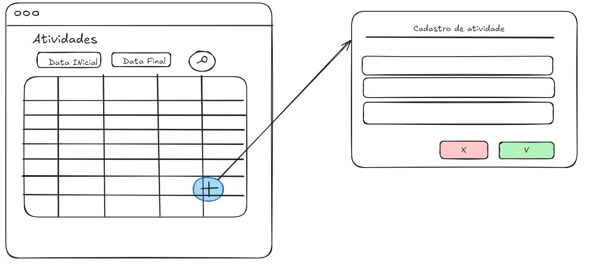

# DayControl
Aplicativo para controle diário de atividades, como exercicios, alimentação, estudos e etc..

## Ideia
Construir para Adiquirir conhecimento. A ideia inicial é construir um app que eu possa hospedar no github pages com firebird, com um fluxo simples de CRUD para adicionar atividades diarias relacionadaas a uma pessoa. 

# Versao 1
    - Criar o projeto com Angular.
    - Criar Comonentes da tela principal.
    - Criar componente da Modal.
    - Exibir lista de registros mokada

Exboço inicial da tela:

# Comandos utilizados
- npm install
    - Utilizado para atualizars as dependências do projeto
- ng serve
    - Iniciar o servidor com o projeto.
- npm install -g json-server
    - Servidor de json para mok dos dados. 
- json-server --watch db.json
    - Iniciar o servidor de json apontando para arquivo db.json
- 
